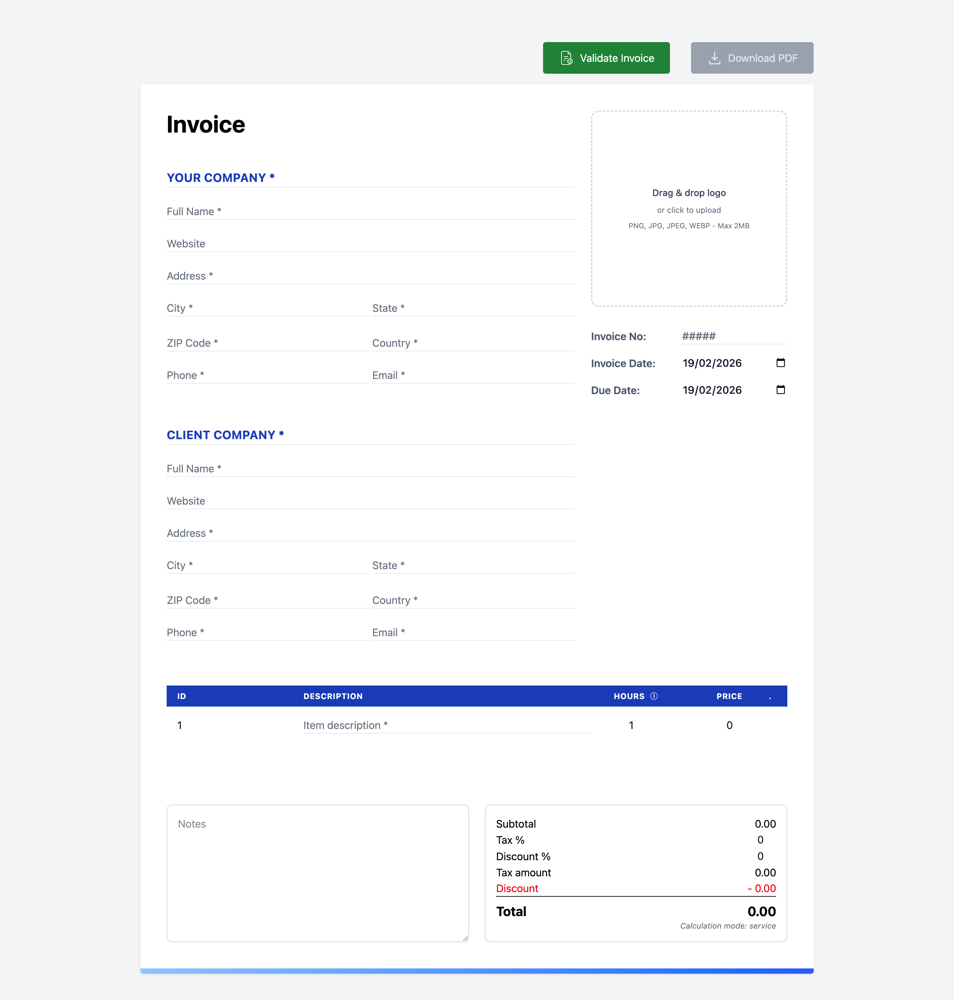
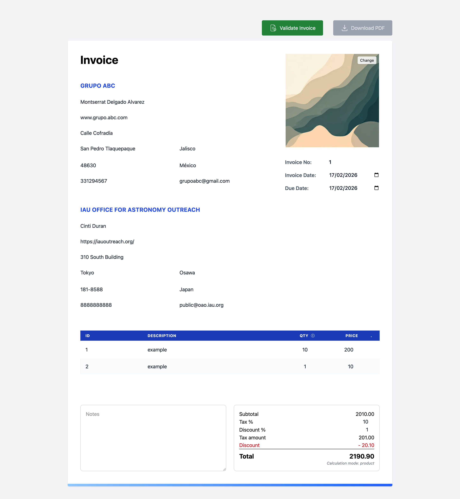
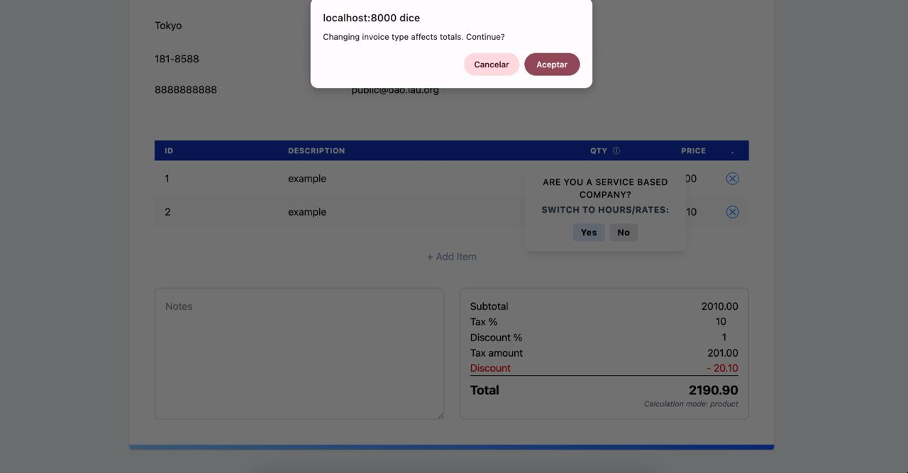
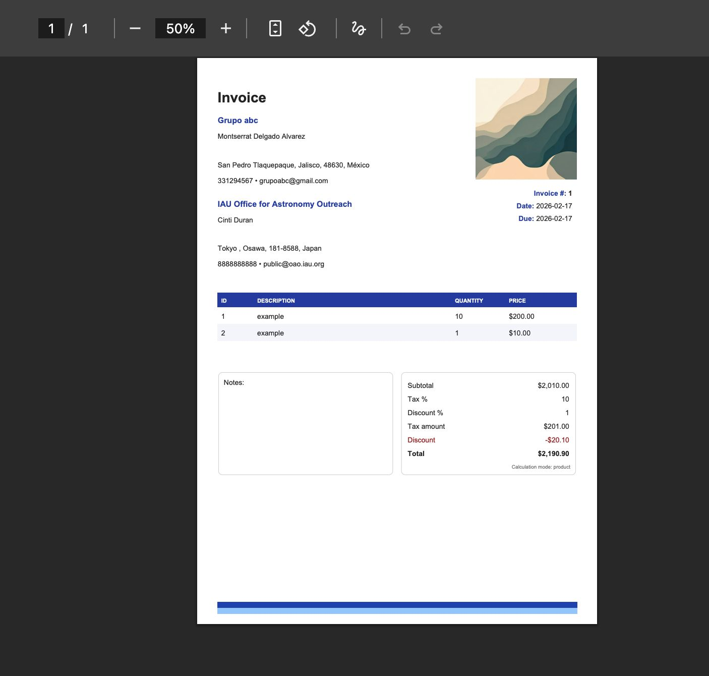
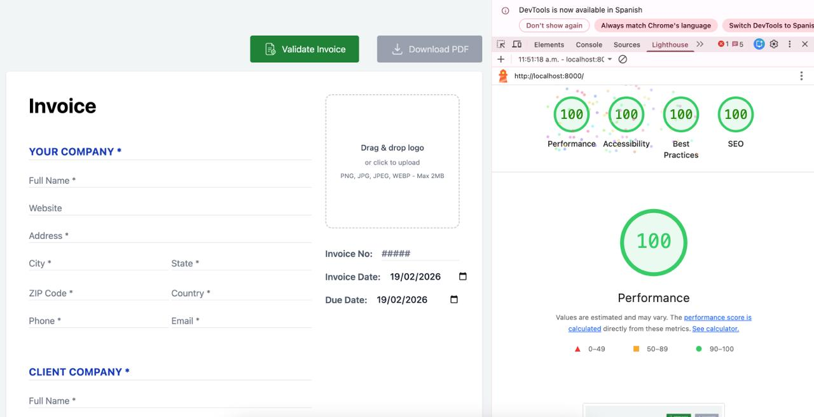

# 📄 Invoice Generator

A web application for generating dynamic invoices built with **Laravel** and **Vue 3**.
The application allows users to create professional invoices with automatic calculations for totals, taxes, and discounts — all in a clean and intuitive interface.

🔗 **Repository:**
<https://github.com/worrington/invoice-generator>

---

## 🚀 Technologies Used

- **Laravel** – Backend framework
- **Vue 3** – Frontend framework
- **Vite** – Frontend build tool
- **Inertia.js**
- **TailwindCSS**

---

## 📦 Requirements

Before running the project, make sure you have installed:

- PHP >= 8.4
- Composer
- Node.js >= 20
- npm
- Git

---

## ⚙️ Installation Guide

### 1 Clone the Repository

```bash
git clone https://github.com/worrington/invoice-generator.git
cd invoice-generator
```

### 2 Install PHP Dependencies

```
composer install
```

### 3 Install Node Dependencies

```bash
npm install
```

### 4 Compile Frontend Assets

For development:

```bash
npm run dev
```

For production build:

```bash
npm run build
npm run build:ssr
```

### 5 Run the Application

```bash
php artisan serve
```

The application will be available at:

```bash
http://127.0.0.1:8000
```

## 🖼️ Images of the App






